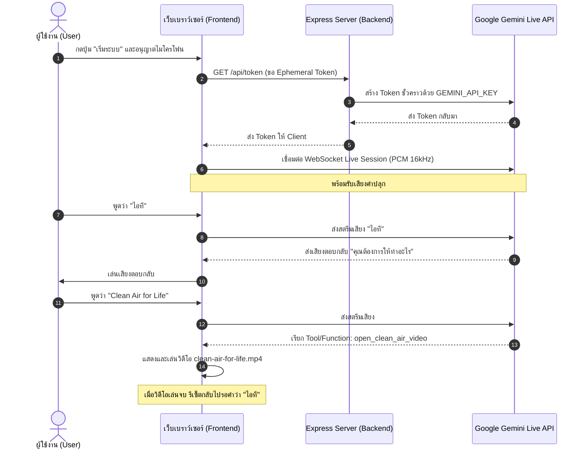

# 🌿 คู่มือและข้อมูลภาพรวมโปรเจกต์ Clean Air Voice (About Project)

**Clean Air Voice Assistant** คือระบบผู้ช่วยสั่งการด้วยเสียงภาษาไทยแบบเรียลไทม์ (Real-time Voice Assistant) ที่พัฒนาขึ้นสำหรับงานและกิจกรรม **Clean Air for Life** โดยผสานพลังของ **Google Gemini Live API** เข้ากับเทคโนโลยี **Web Audio API** บนเว็บเบราว์เซอร์ เพื่อให้การโต้ตอบด้วยเสียงเป็นไปอย่างลื่นไหลและเป็นธรรมชาติ

---

## 🎯 1. วัตถุประสงค์ของโปรเจกต์ (Objectives)

1. **โต้ตอบด้วยเสียงสองทิศทางแบบเรียลไทม์ (Bi-directional Realtime Audio)**: ผู้ใช้สามารถพูดคุยและได้ยินเสียงตอบกลับจาก AI ทันทีโดยแทบไม่มีความหน่วง (Low Latency)
2. **ระบบตรวจจับคำปลุกและคำสั่งเฉพาะ (Wake-word & Command Execution)**:
   - ตรวจจับคำปลุก (Wake Word) คือคำว่า **"ไอที" (IT)**
   - เมื่อระบบถูกปลุก จะตอบกลับว่า **"คุณต้องการให้ทำอะไร"**
   - รองรับคำสั่ง **"Clean Air for Life"** (รวมถึงสำเนียงไทย เช่น *"คลีนแอร์ฟอร์ไลฟ์"*, *"คลีนแอฟอไลฟ์"*) เพื่อเปิดเล่นวิดีโอรณรงค์ Clean Air for Life
3. **ความปลอดภัยของระบบและ API Key (Security by Design)**: ออกแบบระบบให้ทำงานผ่าน **Ephemeral Token (Token ชั่วคราว)** โดยคีย์ลับ `GEMINI_API_KEY` จะถูกเก็บไว้เฉพาะฝั่ง Backend และไม่เปิดเผยไปยังเบราว์เซอร์

---

## 🛠 2. สถาปัตยกรรมและเทคโนโลยีที่ใช้ (Tech Stack)

### 2.1 ฝั่งเซิร์ฟเวอร์ (Backend)
- **Runtime**: Node.js (เวอร์ชัน 18+ หรือ 20+) กำหนดรูปแบบเป็น ES Module (`"type": "module"`)
- **Framework**: Express.js ทำหน้าที่ให้บริการ Static Files และสร้าง Endpoint สำหรับ Token
- **SDK**: `@google/genai` (Google Gen AI SDK)
- **Security**: การออก **Ephemeral Token** ผ่าน `ai.authTokens.create` พร้อมกำหนดอายุการใช้งาน (TTL) และข้อจำกัดโมเดล (`liveConnectConstraints`)

### 2.2 ฝั่งหน้าบ้าน (Frontend)
- **User Interface**: HTML5, Modern CSS, Responsive Layout
- **Audio Processing**: Web Audio API (`AudioContext`, `ScriptProcessorNode` / `AudioWorklet`)
  - แปลงสัญญาณเสียงไมโครโฟนสด (Float32Array) เป็น **Linear PCM 16-bit (16,000 Hz)**
  - เข้ารหัสเป็น Base64 แล้วส่งสตรีมเสียงไปยัง Gemini Live API
  - ถอดรหัสเสียงตอบกลับจาก Gemini (PCM 24,000 Hz) และจัดคิวเล่นเสียงแบบไร้รอยต่อ (Audio Queue Buffer)
- **AI Integration**: เชื่อมต่อกับโมเดล `gemini-3.1-flash-live-preview` ผ่าน WebSocket สดจากเบราว์เซอร์ด้วย Ephemeral Token
- **Media Player**: HTML5 Video Player ควบคุมการเล่นวิดีโอ `clean-air-for-life.mp4`

---

## 🔄 3. แผนภาพและขั้นตอนการทำงานของระบบ (System Workflow)



---

## 📁 4. โครงสร้างไฟล์ในโปรเจกต์ (Project File Structure)

```text
clean-air-voice/
├── .antigravityignore       # กำหนดการละเว้นไฟล์สำหรับระบบ AI
├── .env                     # ไฟล์เก็บตัวแปรสภาพแวดล้อม (GEMINI_API_KEY)
├── .gitignore               # กำหนดการละเว้นไฟล์สำหรับ Git
├── package.json             # ข้อมูลโปรเจกต์และ Dependencies
├── README.txt               # คู่มือการติดตั้งและเริ่มต้นใช้งานแบบย่อ
├── server.js                # Express Backend และ Token API Endpoint
├── public/                  # โฟลเดอร์สำหรับ Static Assets ฝั่ง Client
│   ├── app.js               # ตรรกะการเชื่อมต่อ Gemini Live, Web Audio และ Video
│   ├── index.html           # หน้าเว็บหลัก Clean Air Voice Assistant
│   └── clean-air-for-life.mp4 # ไฟล์วิดีโอที่ใช้เล่นเมื่อสั่งการ
└── markdowns/               # เอกสารคู่มือและมาตรฐานการพัฒนา
    ├── aboutProject.md      # ข้อมูลและภาพรวมของโปรเจกต์ (เอกสารนี้)
    ├── REFACTORCODE.md      # คู่มือแนวทางการพัฒนาและรีแฟคเตอร์โค้ด
    ├── DEBUG.md             # คู่มือการตรวจสอบข้อผิดพลาดและวิธีแก้ปัญหา
    ├── LOG.md               # บันทึกประวัติการเปลี่ยนแปลง (Changelog)
    ├── HTMLCodingGuide.md   # มาตรฐานการเขียน HTML
    ├── CSSCodingGuide.md    # มาตรฐานการเขียน CSS
    ├── TailwindCodingGuide.md # มาตรฐานการเขียน Tailwind CSS
    ├── PHPCodingGuide.md    # มาตรฐานการเขียน PHP
    ├── SQLCodingGuide.md    # มาตรฐานการเขียน SQL
    └── DeMorgansLaws.md     # กฎ De Morgan's Laws และ Early Return
```

---

## 🚀 5. ขั้นตอนการติดตั้งและรันระบบ (Setup & Running)

1. **ติดตั้ง Node.js**: ตรวจสอบว่าเครื่องมี Node.js เวอร์ชัน 18+ หรือ 20+ ขึ้นไป
   ```bash
   node -v
   ```
2. **ติดตั้ง Dependencies**:
   ```bash
   npm install
   ```
3. **ตั้งค่าไฟล์ `.env`**:
   สร้างไฟล์ `.env` ที่ Root directory และระบุ API Key:
   ```env
   GEMINI_API_KEY=your_actual_gemini_api_key_here
   PORT=3000
   ```
4. **เตรียมไฟล์วิดีโอ**: วางไฟล์วิดีโอชื่อ `clean-air-for-life.mp4` ไว้ในโฟลเดอร์ `public/`
5. **เริ่มการทำงานของเซิร์ฟเวอร์**:
   ```bash
   npm start
   ```
6. **เข้าใช้งานผ่านเว็บเบราว์เซอร์**:
   - เปิด Google Chrome หรือ Microsoft Edge ไปที่ `http://localhost:3000`
   - กดปุ่ม **"🎤 เริ่มระบบ"** และกดยินยอมให้ใช้งานไมโครโฟน
   - พูดว่า **"ไอที"** -> ระบบตอบว่า **"คุณต้องการให้ทำอะไร"** -> พูดว่า **"Clean Air for Life"**

---

## 🔒 6. ข้อควรระวังด้านความปลอดภัยและ Best Practices

1. **ห้ามนำ `GEMINI_API_KEY` ไปใส่ในโค้ดฝั่ง Client (JavaScript ใน `public/`) โดยเด็ดขาด**: ต้องใช้ระบบ Ephemeral Token ผ่าน `server.js` เสมอ
2. **ห้ามคอมมิตไฟล์ `.env` ขึ้น Git Repository**: ตรวจสอบไฟล์ `.gitignore` เสมอ
3. **การเข้าถึงไมโครโฟน**: บน Production จำเป็นต้องรันผ่านโปรโตคอล **HTTPS** (ยกเว้น `localhost` สำหรับการทดสอบ)
